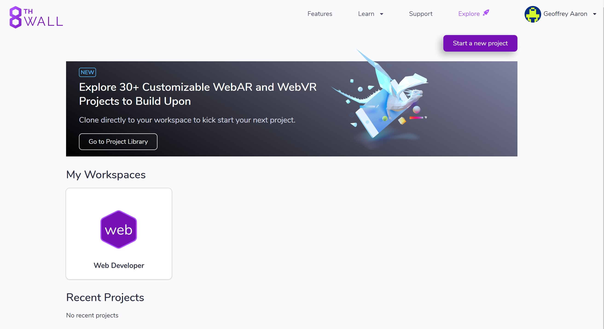
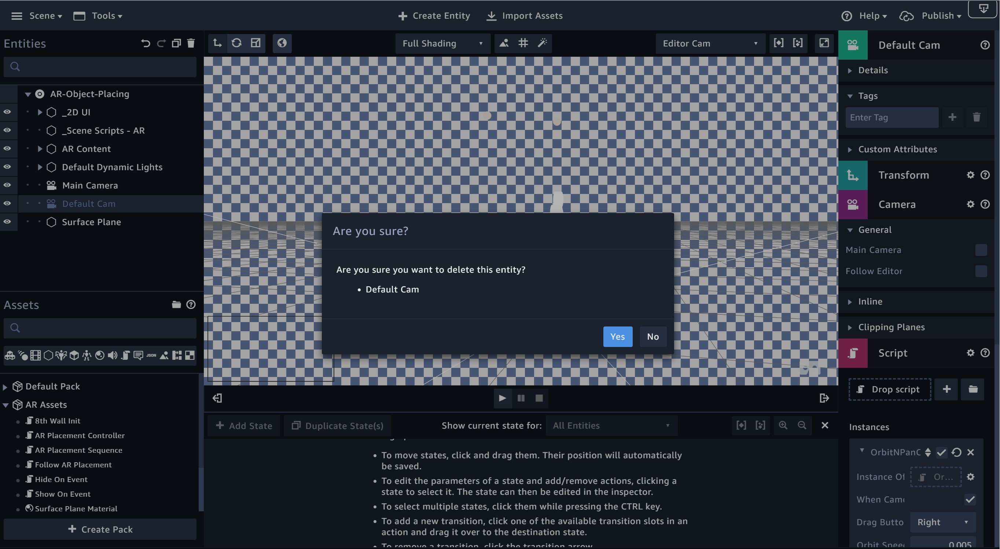

# Sumerian Mannequin Dance AR 

Augmented reality (AR) is an interactive experience of a real-world environment where the objects that reside in the real world are enhanced by computer-generated perceptual information, sometimes across multiple sensory modalities, including visual, auditory, haptic, somatosensory and olfactory.

AR can be defined as a system that fulfills three basic features: a combination of real and virtual worlds, real-time interaction, and accurate 3D registration of virtual and real objects.The overlaid sensory information can be constructive (i.e. additive to the natural environment), or destructive (i.e. masking of the natural environment).This experience is seamlessly interwoven with the physical world such that it is perceived as an immersive aspect of the real environment. In this way, augmented reality alters one's ongoing perception of a real-world environment, whereas virtual reality completely replaces the user's real-world environment with a simulated one.

Bring a new dimension to your web and mobile applications with Amazon Sumerian. 3D immersive experiences are breathing new life into user experiences on the web, increasing customer engagement with brands and improving productivity in the workplace.As a web-based platform, your immersive experiences are accessible via a simple browser URL and are able to run on popular hardware for AR/VR.With billions of AR-capable mobile devices in people’s pockets, it's easier than ever to deliver AR experiences that help customers connect with businesses.

## Scenario

This tutorial will use environment tracking, which tracks a fixed point in the physical world. This allows a user to choose an arbitrary point on a physical surface and pin the AR world origin, or individual AR entities to that location.

It will has mannequin ready to dance. Click the screen to place the mannequin and let the mannequin dance.

## Prerequisites

> The workshop’s region will be in ‘N.Virginia’

> Prepare developer account __8th Wall__ for this tutorial. You can signup for a free developer account at [8thWall.com](https://www.8thwall.com/)

> Download [ar-object-placing-bundle-20200407_090912.zip](./material/ar-object-placing-bundle-20200407_090912.zip).

### Lab tutorial

#### Set up 8th Wall Image Targets

1. In to your 8th Wall account Dashboard, and click “Start a new project”.

2. Give the project a name __ar-object-placing__, and click __Create__.

3. Authorize your test device by clicking the __Device Authorization__ button and scan the QR Code. (Be sure to then launch that link in the native browser on your phone before authorizing.)

4. Open __Setting__ icon on the left pane, then copy and save your **8th Wall app key** for use later in this tutorial.

### Deploy Sumerian

1. In the AWS Management Console, on the service menu, click **Sumerian**.

2. Select **Empty** on **Create scene from template** part

3. Give name with **AR-Object-Placing-Yourname**.

4. On top, Click **Import Assets**.

5. On Right side, **Import From Disk**, Click **Browse**, Select [ar-object-placing-bundle-20200407_090912.zip](./material/ar-object-placing-bundle-20200407_090912.zip). file.

6. Wait for a while until everthing come out on your Dashboard.

7. On the left panel, Click **Main Camera**, look on right panel, select **Camera**. tick **Main camera**, and than clik the **Default Camera** on Left panel, **Delete**(by type **backspace/del**).

8. On the left pane below, edit **8th Wall Init**

9. Change the **<APP_KEY>** with your the **8th Wall app key**

10. Publish your sumerian.

### Test the Sumerian
Open the Link of your sumerian and place the mannequin.

### Clean Up

To delete the AWS resources, perform the tasks below in order:

1. Delete AWS Sumerian (Click your sumerian project, and look on left panel, **Delete**)

## Conclusion
Congratulations! We now have learned how to:
- Using AWS Sumerian
- How to put video on AWS Sumerian
- HIntegrating the 8th Wall AR SDK into a Sumerian project
- Supporting a basic AR placement user flow
- Integrating the 8th Wall JavaScript library

